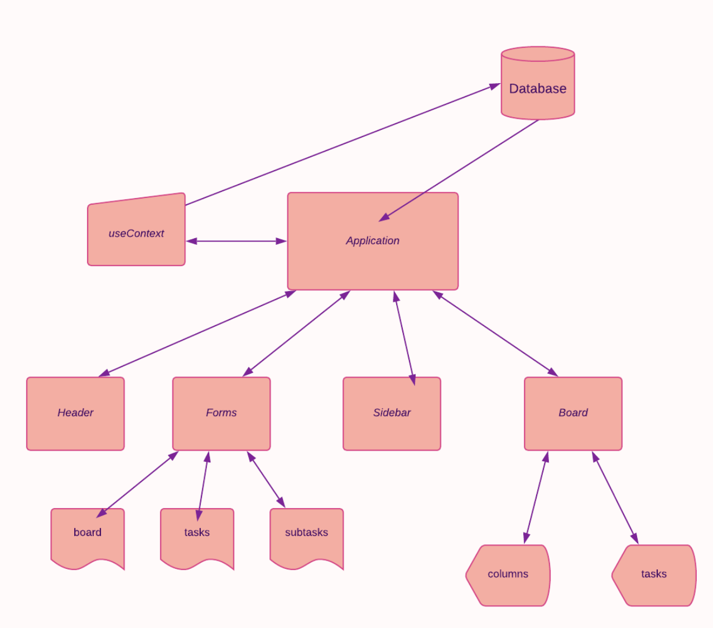

# Kanban Management App

This is a solution to the [Kanban task management web app challenge on Frontend Mentor](https://www.frontendmentor.io/challenges/kanban-task-management-web-app-wgQLt-HlbB). Frontend Mentor challenges help you improve your coding skills by building realistic projects.

A [Next.js](https://nextjs.org/) project bootstrapped with [`create-next-app`](https://github.com/vercel/next.js/tree/canary/packages/create-next-app).

## Table of contents

- [Kanban management app](#kanban-management-app)
  - [Table of contents](#table-of-contents)
  - [Overview](#overview)
    - [The challenge](#the-challenge)
    - [Screenshot](#screenshot)
    - [Links](#links)
  - [My process](#my-process)
    - [Built with](#built-with)
    - [What I learned](#what-i-learned)
    - [Continued development](#continued-development)
    - [Useful resources](#useful-resources)
  - [Author](#author)
  - [Acknowledgments](#acknowledgments)

## Overview

### The challenge

Your users should be able to:

 - View the optimal layout for the app depending on their device's screen
 - See hover states for all interactive elements
 - Create, read, update, and delete boards and tasks
 - Receive form validations when trying to create/edit boards and tasks
 - Mark subtasks complete and move tasks between columns
 - Hide/show the board sidebar
 - Toggle the theme between light/dark modes
 
 - **Bonus**: Keep track of changes, even after refreshing the browser
 - **Bonus**: Build this project as a full-stack application

### Screenshots

### Links

### My process

I had worked previously with NextJs in creating a full-stack website. I enjoyed the experience and knew I wanted to use the framework again for this project as I also wanted to make this one full stack.

Since the work was building things I was already familiar with, most of the project dealt with re-solidifying what I have learned so far. However, there were certain areas of focus in particular that required extra attention:

 1. ***Implementation:*** How should the various components interact on a single page?
 2. ***Theme propagation:*** How should I propagate the color theme throughout the application?
 3. ***Form handling:*** How should I handle and render the forms?
 4. ***CSS:*** Any advantages to using CSS grid vs something else and can I take advantage of SCSS?

**Implementation:**

**Theme propagation:** 
 I understand there are many popular frameworks for styling with javascript and promoted with this purpose in mind. However, I am comfortable working with CSS and I like having it seperated from the html. It made things easier being a single-page application. Though, I could have handled multiple pages making use of React's useContext API
   
**Form handling:** 
 I found it best to have them wrapped in a component on the main window and pass props based on which form was called. It allowed me to share many of the styles used and create a uniform look. I don't think much difficulty arises from keeping track of props, but I understand this may not be the right solution for a larger application.
   
**CSS:** 
 I messed up. My original plan was to use CSS grid like I had used previously. Then I decided to switch and not use. Layout is fine but feels fragile and that was apparent when implementing the sidebar for larger layouts.
-  On previous projects I tried hard to keep objects seperated and treated as blocks.
I felt it greatly reduced the chance of conflict, allowed for better scaling, and made things easier to fix when required. However, it also did require some extra diligence and didn't take advantage of CSS's natural cascading feature.
- This time I was a little more lose on block separation and took some liberties utilizing the cascade property, which allowed me to develop more quickly and repurpose some code I otherwise wouldn't have. This was great, but problems started to arise later on as some conflicts began to show.
   
### Built with

- Typescript
- ReactJs
- NextJs
- Prisma
- NextAuth
- custom hooks
- Postgres
- Figma
- BEM
- SCSS

### What I learned

How to utilize and take advantage of Typescript with React.

It was difficult at first. I found things confusing and felt it made development overcomplicated. I was quite comfortable with typed languages like C++ and Haskell, but Typescript, I wanted to throw out. I understood its advantage but despised it. And searched for excuses to drop it. However, I slowly worked at getting more and more comfortable. Now I don't think I will ever build another project without Typescript. Since ReactJs involves a lot of passing props between components I found it very useful to be able to take advantage ot the type stubs made because of Typescript. It reduced many unnecessary errors.

### Useful resources

- [Stackoverflow](https://stackoverflow.com) - Where would I be without you? Helped with some bugs I ran into.
- [Dan Abramov's useEffect Guide](https://overreacted.io/a-complete-guide-to-useeffect/) - Helped me get a better understanding of the useEffect hook. I was having issues with rendering that I wasn't sure how to solve and found the guide helpful along with the source above.
- [Prisma Docs](https://www.prisma.io/) - I prefer raw SQL but my knowledge is not that great and this made working with Postgres super easy. The docs were great also. 

## Author

That would be me.

## Acknowledgments

I am thankful for internet humour as I was often near the brink of banging my head on the desk.

### TODOS

- Desktop layout needs some tweaks with font size and spacing
- Migrate database to server for production
- Find a way to make cleaner state transitions
  - You can see objects scatter off screen when transitioning from an empty board to a full board.

